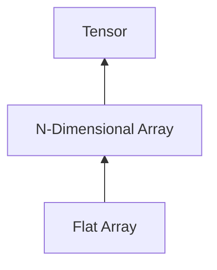

# Tiny-PyTorch

## Introduction

Tiny-Pytorch is a deep learning system that is similar in nature to **Pytorch**. It involves implementing the core underlying algorithms behind deep learning systems such as **automatic differentiation** and different optimization algorithms such as Stochastic Gradient Boosting (SGD) and Adaptive Momentum (Adam).

The main learning and critical part of this project is building everything from the ground up:



## Learning Objectives

The main objectives to build this framework:

- Build deep learning systems:
  - Contribute to open-source deep learning frameworks.
  - Work on developing my own framework for specific tasks. I have been collecting my own implementation of different things in Pytorch such as analyzing gradients of each layer.
- Use existing systems more effectively:
  - Understanding how the internals of existing deep learning systems work let you use them much more efficiently.
  - The only way to understand how things really work is to build it from scratch.
- Understand how operations are carried on both CPU and GPU so I can optimize my customized models/layers to run more efficiently.

## Road Map

To make things simple, we will follow top-down approach. In other words, we
will first build `Tensor` and all its machinery such as `Operations`,
_automatic differentiation_, etc.. During this phase, we will be using `numpy`
as our backend. Once we're done with basic building blocks of our `Tensor`, we
will move on to build `NDArray` and different backends that can be used to do
the computation.

- **Phase I**:
  - [x] `Tensor`: A multi-dimensional array that includes elements of the same
        type. It is the main component in our automatic differentiation because it
        will include: operation that created it, input data used in the operation,
        the output data, etc. In the case it was a leaf or deteched `Tensor`,
        everything will be `None`.
  - [x] `Op`: Operations on `Tensor`s. Each operation should implement forward
        and backward pass and returns a new `Tensor`.
  - [x] `Automatic Differentiation`: The method we will be using to build the
        automatic differentiation framework is called **Reverse Mode Automatic
        Differentiation (AD)**. It is much more efficient that the alternative
        **Forward Mode Automatic Differentiation (AD)**.
  - [x] `init`: Functions to initialize neural network parameters.
  - [x] `nn`: Basic building blocks of neural network graph such as `Linear`,
        `Conv2d`, `BatchNorm`, etc.
  - [x] `optimizer`: Implementation of various optimizations algorithms such as
        `SGD` and `Adam`.
  - [x] `data`: Classes to load various types of data; mainly `Dataset` and
        `DataLoader`.
- **Phase II**:
  - [ ] `NDArray`: A generic class that supports multiple backends and
        provide us with *strided\*\* array. All the underlying arrays are flat
        arrays stored in row-major order, but `NDArray` will help us represent
        any multi-dimensional arrays using *offset, strides, shape\*.
  - [ ] Numpy backend (default backend)
  - [ ] CPU backend
  - [ ] Cuda backend
  - [ ] CNN and its main operations such as _padding_ and _dilation_
  - [ ] Resnet
  - [ ] RNN
  - [ ] LSTM
  - [ ] LLM

## Limitations

- Broadcasting has to be done explicitly for all element-wise operations if
  both ndarrays/tensors are not of the same shape. For example, if we have two
  tensors `x` & `y` that have `(10,)` and `(20, 10)` shapes respectively. We
  can add them together as follows:
  ```python
  x.reshape((1, 10)).broadcast_to((20, 10)) + y
  ```

## License

Tiny-PyTorch has Apache License, as found in the [LICENCE](LICENSE) file.
