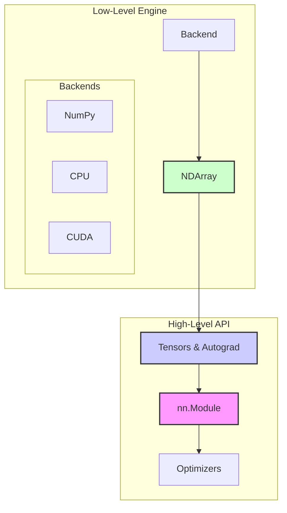

[](https://www.python.org/downloads/)
[](https://pypi.org/project/tiny-pytorch/)
[](https://pypi.org/project/tiny-pytorch/)
[](https://codecov.io/gh/imaddabbura/tiny-pytorch)
[](https://github.com/psf/black)

---

<p align="center">
  
</p>

# Tiny-PyTorch 🧠

**Unravel the magic of modern deep learning by building a PyTorch-like framework from the ground up.**

Tiny-PyTorch is an educational deep learning framework built entirely in Python. It demystifies the core machinery of libraries like PyTorch by providing a clean, focused, and from-scratch implementation of the essential components.

---

## Philosophy: Understanding by Building

The best way to truly understand how complex systems work is to build them yourself. Tiny-PyTorch is born from this philosophy. While production frameworks like PyTorch and TensorFlow provide powerful, high-level abstractions, their internal complexity can be a barrier to learning.

This project strips away those abstractions, allowing you to:

- **See the Core Logic:** Grasp the fundamental algorithms and data structures that power deep learning, from the `Tensor` object to the backpropagation process.
- **Connect Theory to Code:** Bridge the gap between the mathematical concepts of deep learning and their concrete implementation.
- **Become a Better Practitioner:** Use high-level frameworks more effectively by understanding their internal mechanics, performance trade-offs, and potential pitfalls.

---

## ✨ Core Features

- **Dynamic Computation Graph:** Tensors track their history, allowing for flexible model architectures.
- **Reverse-Mode Automatic Differentiation:** An efficient gradient calculation engine (`autograd`) built from scratch.
- **Extensible `nn.Module` System:** A familiar API for building complex neural network layers and models.
- **Standard Optimizers:** Implementations of `SGD` and `Adam` to handle parameter updates.
- **Hardware Acceleration:** A pluggable backend system supporting `NumPy`, custom `CPU` (C++), and `CUDA` (GPU) operations.
- **Data Loading Utilities:** `Dataset` and `DataLoader` classes for efficient data pipelines.

---

## 🏗️ Project Architecture

The framework is built in a bottom-up fashion, where each layer of abstraction relies on the one below it. This mirrors the logical structure of major deep learning libraries.



1.  **Backends (NumPy, CPU, CUDA):** Perform the actual mathematical computations on flat arrays of data.
2.  **NDArray:** A generic, strided N-dimensional array class that provides a unified interface over different backends.
3.  **Tensor & Autograd:** The heart of the framework. A `Tensor` wraps an `NDArray` and builds a dynamic computation graph. The `autograd` engine traverses this graph to perform reverse-mode automatic differentiation.
4.  **High-Level API (`nn`, `optimizer`):** Provides the familiar modules, layers, and optimization algorithms for building and training neural networks.

---

## 🚀 Quick Start

First, clone the repository and install it in editable mode.

```bash
git clone https://github.com/your-username/tiny-pytorch.git
cd tiny-pytorch
pip install -e .
```

Here's a simple example of defining a model and running a forward/backward pass.

```python
import tiny_pytorch as tp
import tiny_pytorch.nn as nn


# 1. Define a simple model
class SimpleNet(nn.Module):
    def __init__(self, in_features, out_features):
        self.fc1 = nn.Linear(in_features, 64)
        self.relu = nn.ReLU()
        self.fc2 = nn.Linear(64, out_features)

    def forward(self, x):
        x = self.fc1(x)
        x = self.relu(x)
        return self.fc2(x)


# 2. Initialize model, optimizer, and loss function
model = SimpleNet(in_features=10, out_features=1)
optimizer = tp.optim.Adam(model.parameters(), lr=0.001)
loss_fn = nn.MSELoss()

# 3. Create dummy data
x_train = tp.randn(32, 10, requires_grad=True)
y_true = tp.randn(32, 1)

# 4. Perform a single training step
optimizer.zero_grad()  # Reset gradients
y_pred = model(x_train)  # Forward pass
loss = loss_fn(y_pred, y_true)  # Compute loss
loss.backward()  # Backward pass (autograd)
optimizer.step()  # Update weights

print(f"Loss: {loss.item():.4f}")
```

---

## 🗺️ Roadmap

The project is developed in two main phases. Our current progress is tracked below.

- **Phase I: Core Framework (NumPy Backend)**
  - [x] `Tensor`: The main multi-dimensional array with autograd support.
  - [x] `Op`: The base class for all tensor operations.
  - [x] `Automatic Differentiation`: Reverse-mode autograd engine.
  - [x] `init`: Parameter initialization functions (`kaiming`, `xavier`, etc.).
  - [x] `nn`: Core neural network layers (`Linear`, `ReLU`, `BatchNorm`, `Conv2d`).
  - [x] `optimizer`: `SGD` and `Adam` optimizers.
  - [x] `data`: `Dataset` and `DataLoader` for data handling.
- **Phase II: Hardware Acceleration & Advanced Models**
  - [x] `NDArray`: Generic, strided N-dimensional array.
  - [x] NumPy Backend
  - [x] CPU Backend (C++)
  - [x] CUDA Backend (GPU)
  - [x] Advanced CNN operations (e.g., `padding`, `dilation`).
  - [ ] ResNet implementation.
  - [x] RNN and LSTM layers.
  - [ ] A simple transformer-based Large Language Model (LLM).

---

## 📚 Documentation

The official documentation, including detailed API references and tutorials, is hosted at:
**[https://imaddabbura.github.io/tiny-pytorch/](https://imaddabbura.github.io/tiny-pytorch/)**

---

## ⚠️ Limitations

As an educational project, Tiny-PyTorch has some intentional simplifications:

- **Explicit Broadcasting:** Broadcasting for element-wise operations must be done manually if tensor shapes do not match.
- **Single Data Type:** `NDArray` only supports the `float32` `dtype`.
- **Contiguous Memory:** Operations on the underlying 1D array require a call to `compact()` to ensure the data is in a contiguous memory block.
- **Limited Reductions:** Reduction operations (e.g., `sum`, `max`) can only be performed on a single axis or all axes at once.

---

## License

Tiny-PyTorch is licensed under the Apache License 2.0. See the [LICENSE](https://www.google.com/search?q=LICENSE) file for details.
