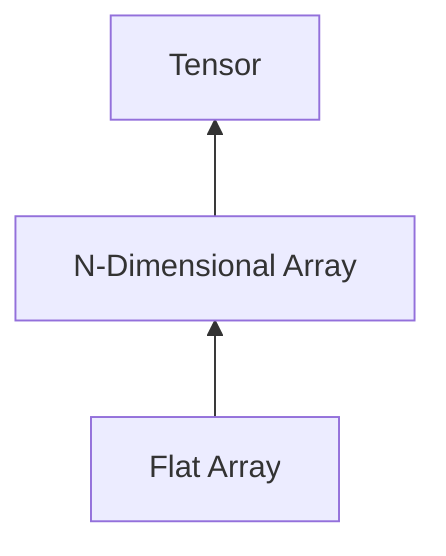

# Welcome to Tiny Pytorch

Tiny-Pytorch ([GH repo](https://github.com/ImadDabbura/tiny-pytorch), [Documentation](imaddabbura.github.io/tiny-pytorch/)) is a deep
learning system that is similar in nature to **Pytorch**. It involves
implementing the core underlying machinery and algorithms behind deep learning
systems such as 1) **Automatic differentiation**, 2) **Tensor** (multi-dimensional
array), 3) **Neural network** modules such as **Linear/BatchNorm/RNN/LSTM**, 4) **Optimization** algorithms such as **Stochastic Gradient Boosting (SGD)** and **Adaptive
Momentum (Adam)**, 5) **Hardware acceleration** such as GPUs, etc.

The main learning and critical part of this project is building everything
from the ground up:

The main objectives to build this framework:

- Build deep learning systems

    * Contribute to open-source deep learning frameworks.
    * Work on developing my own framework for specific tasks. I have been
    collecting my own implementation of different things in Pytorch such as
    analyzing gradients of each layer.

- Use existing systems more effectively:

    * Understanding how the internals of existing deep learning systems work
    let you use them much more efficiently.
    * The only way to understand how things really work is to build it from scratch.

- Understand how operations are carried on both CPU and GPU so I can optimize
my customized models/layers to run more efficiently.
