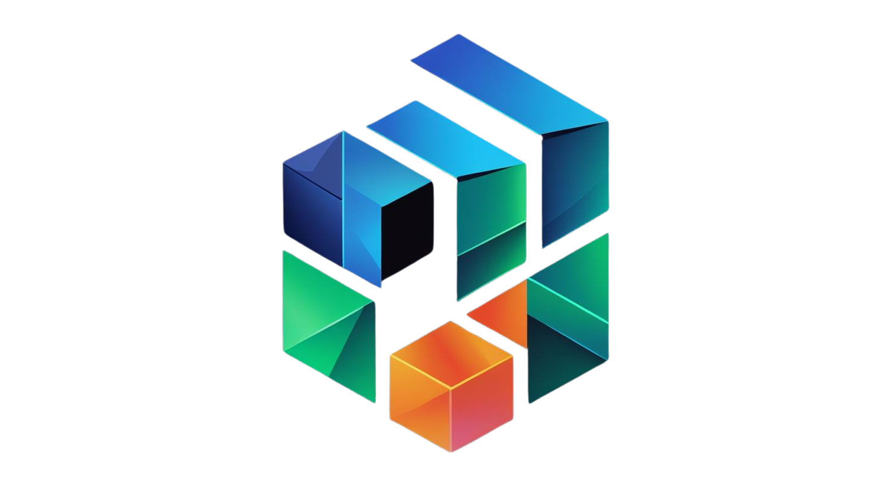

<p align="center">
    
</p>

# **Tiny-PyTorch: Build Your Own Deep Learning Universe 🌌**

Hello, fellow builders and curious minds. I'm an AI scientist, and like many of you, I've spent countless hours marveling at the power of frameworks like PyTorch and TensorFlow. They are the engines of modern AI, capable of incredible feats. But have you ever found yourself wondering what truly lies beneath the sleek `model.fit()` or `loss.backward()` commands?

That question sparked a journey for me. A journey deep into the core principles of deep learning, driven by a conviction that to truly master a tool, you must first understand how it's made. **Tiny-PyTorch** is the result of that journey—a testament to late nights, relentless debugging, and the sheer joy of seeing complex theory click into place through code. This project is my invitation to you to unravel the magic of deep learning, not just as a user, but as a creator.

This isn't just another library. It's a transparent, from-scratch odyssey into the heart of neural networks, built with the soul of a teacher and the mind of an engineer.

## **The Philosophy: From Mystery to Mastery 🧠**

The most profound learning happens when you roll up your sleeves and build. Production frameworks are fantastic for their power and abstraction, but that very abstraction can become a wall, hiding the elegant machinery within. Tiny-PyTorch tears down that wall.

My goal was to create a space where you can:

- **Connect with the Code:** Bridge the gap between the abstract mathematical ideas of deep learning and their tangible, coded reality.
- **Witness the Core Logic:** Go beyond high-level APIs to grasp the fundamental data structures and algorithms, from the humble `Tensor` to the powerful `autograd` engine.
- **Sharpen Your Intuition:** By understanding the internal mechanics, you'll use high-level frameworks more effectively, sidestepping common pitfalls and optimizing with greater insight.

This is your chance to trade black boxes for a crystal-clear view of the foundations you rely on every day.

---

## **✨ Core Features**

Tiny-PyTorch is packed with the essential components that power modern deep learning, all built from the ground up for clarity and educational value.

- **🧠 Dynamic Computation Graph:** Tensors remember their history, creating a flexible and intuitive graph on the fly.
- **⚙️ Reverse-Mode Autograd:** A from-scratch automatic differentiation engine that demystifies the backpropagation process.
- **🧱 Extensible `nn.Module` System:** A familiar, modular API for constructing intricate neural network architectures.
- **🛠️ Standard Optimizers:** Classic `SGD` and `Adam` implementations to handle the crucial task of parameter updates.
- **🚀 Pluggable Acceleration:** A versatile backend system that supports `NumPy`, and custom `CPU` (C++) and `CUDA` (GPU) operations for a true performance deep-dive.
- **📦 Efficient Data Handling:** `Dataset` and `DataLoader` utilities to build robust and efficient data pipelines.

---

## **🏗️ The Architecture: A Bottom-Up Build**

The framework is designed in logical layers, mirroring the structure of major deep learning libraries. Each piece builds upon the one before it, creating a clear path from raw computation to high-level modeling.


1.  **Backends (NumPy, CPU, CUDA):** The foundational layer where the raw number-crunching happens on flat arrays.
2.  **NDArray:** A generic, strided N-dimensional array that provides a unified interface over the various computational backends.
3.  **Tensor & Autograd:** This is the heart of Tiny-PyTorch. The `Tensor` object wraps an `NDArray` and constructs the computation graph, which the `autograd` engine then traverses to calculate gradients.
4.  **High-Level API (`nn`, `optimizer`):** The user-facing layer that provides the familiar tools for building and training neural networks.

---

## **🚀 Quick Start: Your First Training Step**

Let's get our hands dirty. First, clone the repository and install the package.

```bash
git clone https://github.com/your-username/tiny-pytorch.git
cd tiny-pytorch
pip install -e .
```

Now, here’s how you can define a model, run a forward pass, and perform backpropagation in just a few lines of code.

```python
import tiny_pytorch as tp
import tiny_pytorch.nn as nn


# 1. Define your model architecture
class SimpleNet(nn.Module):
    def __init__(self, in_features, out_features):
        self.fc1 = nn.Linear(in_features, 64)
        self.relu = nn.ReLU()
        self.fc2 = nn.Linear(64, out_features)

    def forward(self, x):
        x = self.fc1(x)
        x = self.relu(x)
        return self.fc2(x)


# 2. Initialize the model, optimizer, and loss function
model = SimpleNet(in_features=10, out_features=1)
optimizer = tp.optim.Adam(model.parameters(), lr=0.001)
loss_fn = nn.MSELoss()

# 3. Create some dummy data
x_train = tp.randn(32, 10, requires_grad=True)
y_true = tp.randn(32, 1)

# 4. Run a single training step
optimizer.zero_grad()  # Clear old gradients
y_pred = model(x_train)  # Forward pass: get predictions
loss = loss_fn(y_pred, y_true)  # Calculate the loss
loss.backward()  # Backward pass: compute gradients
optimizer.step()  # Update model weights

print(f"Loss: {loss.item():.4f}")
```

---

## **🗺️ The Journey So Far: Project Roadmap**

This project has been a marathon, not a sprint. It's built in two main phases, and I'm proud to share the progress that's been made through sheer perseverance and a passion for the craft.

- **Phase I: Core Framework (NumPy Backend)**
  - [x] `Tensor` & `Op` Base Class
  - [x] `Automatic Differentiation` Engine
  - [x] Parameter `init` Functions
  - [x] Core `nn` Layers (`Linear`, `ReLU`, `BatchNorm`, `Conv2d`)
  - [x] `SGD` and `Adam` Optimizers
  - [x] `Dataset` and `DataLoader` Utilities
- **Phase II: Hardware Acceleration & Advanced Models**
  - [x] Generic `NDArray`
  - [x] NumPy Backend
  - [x] CPU Backend (C++)
  - [x] CUDA Backend (GPU)
  - [x] Advanced CNN Operations
  - [x] RNN and LSTM Layers
  - [x] ResNet Implementation
  - [ ] A Simple Transformer-based LLM

---

## **⚠️ A Note on Simplicity: Intentional Limitations**

Tiny-PyTorch is first and foremost an educational tool. To keep the focus on the core concepts, I made a few simplifying design choices:

- **Manual Broadcasting:** Broadcasting for element-wise operations needs to be done explicitly if tensor shapes don't align.
- **Single Data Type:** The `NDArray` currently supports the `float32` `dtype` exclusively.
- **Contiguous Memory:** Operations may require a call to `compact()` to ensure data is in a contiguous memory block.
- **Limited Reductions:** Reduction operations like `sum` or `max` are limited to a single axis or all axes at once.

These aren't oversights; they are deliberate choices to keep the codebase clean and focused on its educational mission.

Thank you for joining me on this adventure. I hope Tiny-PyTorch helps you have as many "aha\!" moments as I had while building it.

Happy coding\!
